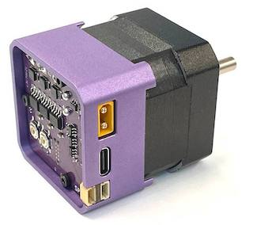

# Servos are dope.

Compared to the steppers we stick on our 3D printers, CNC machines and paintball turrets:
 - They're way faster 🏃
 - Far more powerful (higher torque for longer) 💪
 - More accurate (higher resolution) 🎯
 - And they're closed loop (they know where they are) 🤖

The only downside is that they're expensive, like hundreds of dollars.

Introducing spin ✨ - the $30 servo for the masses (designed with atopile)

## Wiggle wiggle wiggle

## Goals + (default) Specs

- Obviously better option than stepper motors for 3D printers, CNC machines and robotics
- Open-source design that is easy to:
  - contribute to
  - fork maintainable derivatives of
  - robust

- 2x CAN comms with JST-GH connectors
- XT30 power connector
- 0.25Nm continuous rated torque (0.75Nm peak)
- <0.1° resolution
- 12V-24V input voltage

## Getting started

If you don't have access to [atopile](https://gitlab.atopile.io/atopile/atopile) - hang tight, it's coming soon!
